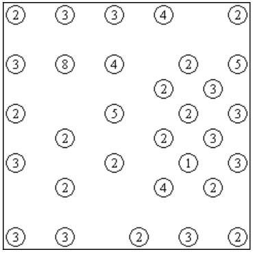
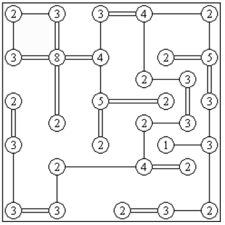

**Hashiwokakero** (from Japanese "Hashi o kakero"; literally "build bridges"; also known as *"Hashi"*, *"Bridges"*, *"Chopsticks"*, or *"Ai-Ki-Ai"*) is a type of logic puzzle. It is played on a rectangular grid with no standard size, although the grid itself is not usually drawn. Some cells start out with (usually encircled) numbers from 1 to 8 inclusive; these are the islands. The rest of the cells are empty.

The goal is to connect all of the islands into a single connected group by drawing a series of bridges between the islands. The bridges must follow certain criteria:

- They must begin and end at distinct islands, travelling a straight line in between.
- They must not cross any other bridges or islands.
- They may only run orthogonally.
- At most two bridges connect a pair of islands.
- The number of bridges connected to each island must match the number on that island.

